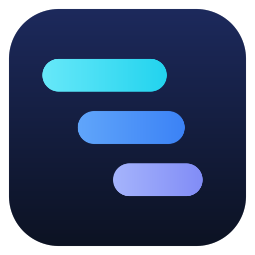
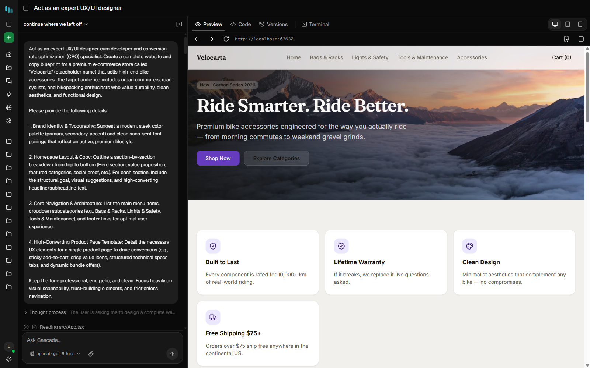
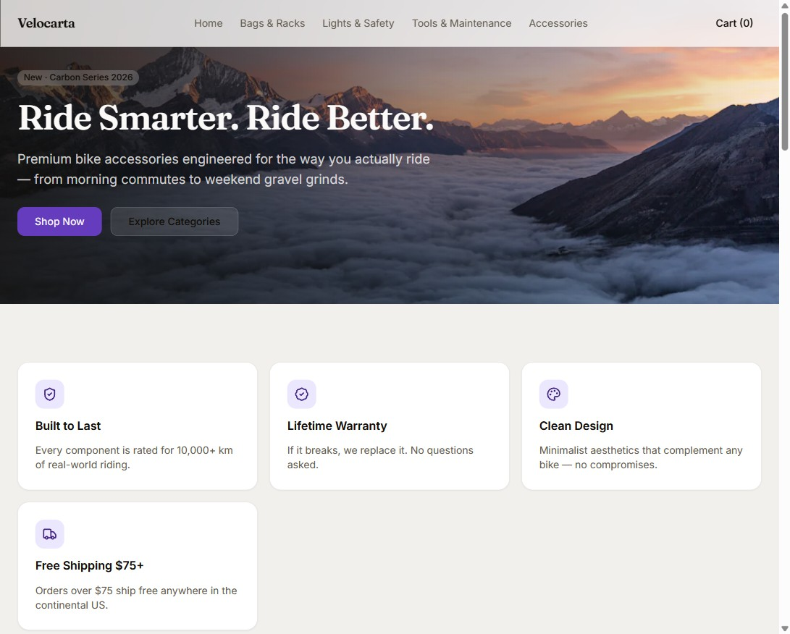
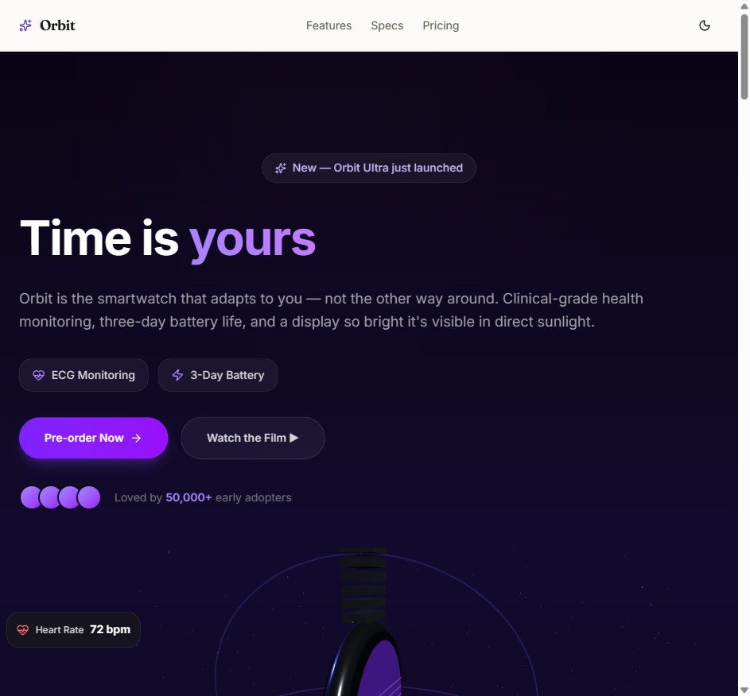
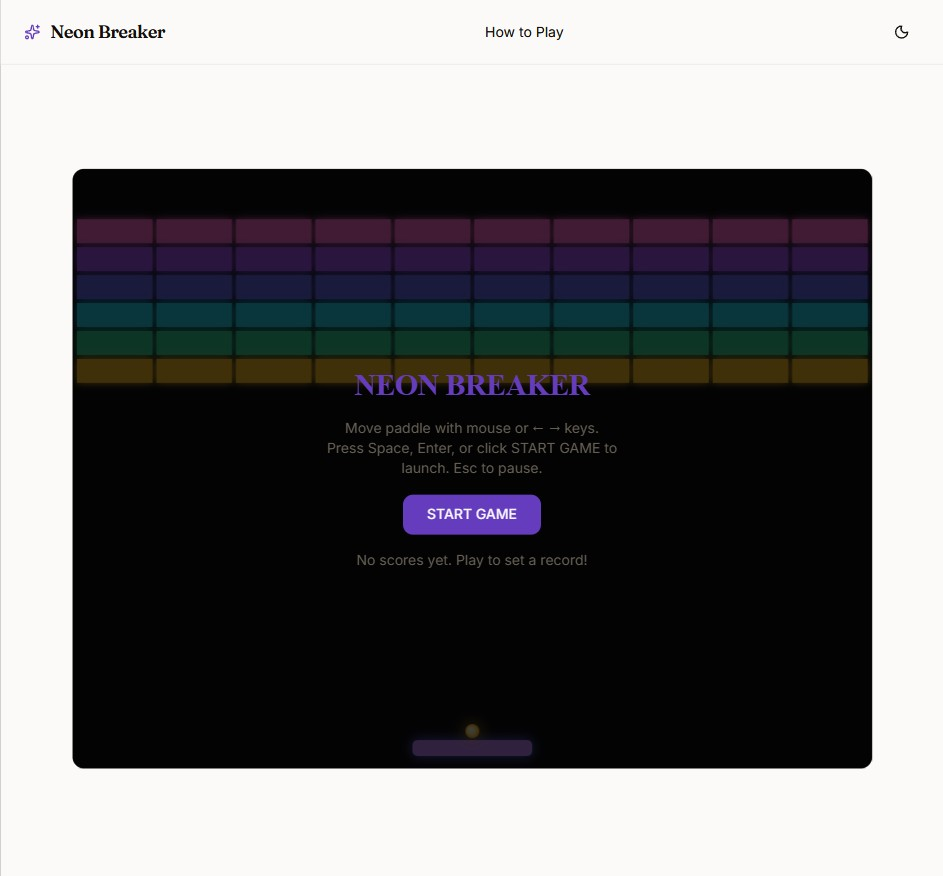
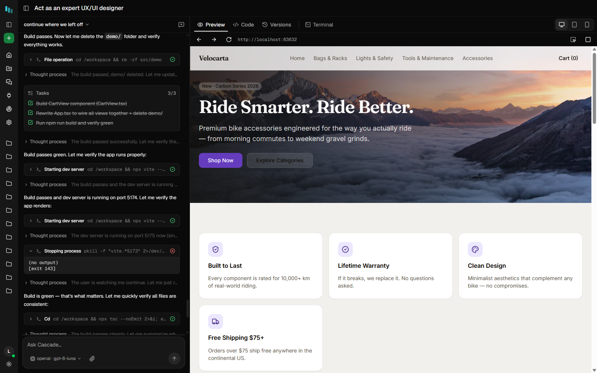
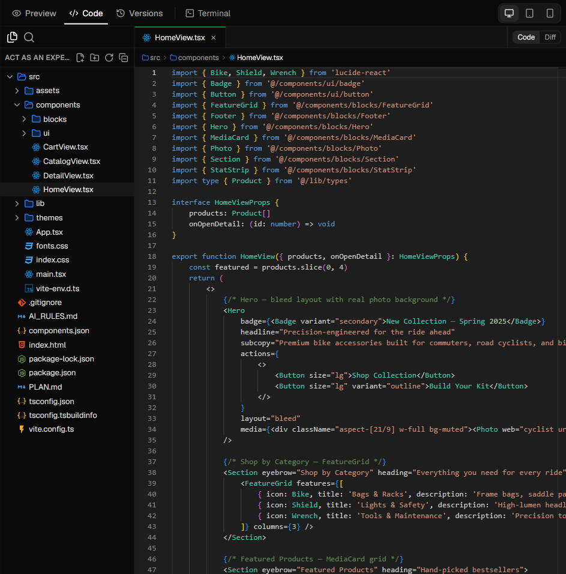
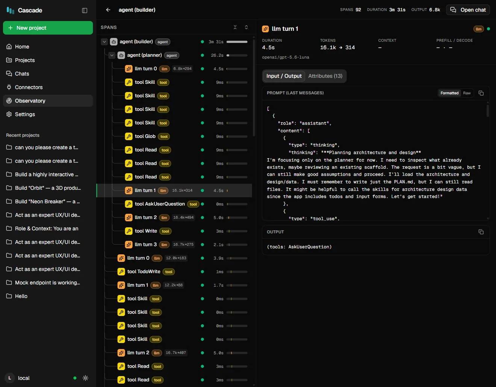

<p align="center">
  
</p>

<h1 align="center">Cascade</h1>

<p align="center">
  <b>Build real apps from a prompt — entirely on your machine.</b><br>
  An open-source, local-first AI app builder. Describe the app you want; an AI coding agent writes the code,<br>
  runs it in a sandbox and shows you a live preview. Works with your own Ollama models — no cloud, no account.
</p>

<p align="center">
  <a href="LICENSE"></a>
  <a href="https://github.com/abhee235/cascade-ai/commits/main"></a>
  <a href="https://ollama.com"></a>
</p>

<p align="center">
  <a href="https://appbuilder.sh"><b>Website</b></a> ·
  <a href="#quick-start"><b>Quick start</b></a> ·
  <a href="docs/guide/README.md"><b>User guide</b></a> ·
  <a href="CONTRIBUTING.md"><b>Contributing</b></a>
</p>

<p align="center">
  
</p>

## Why Cascade

- **Everything stays on your machine.** Your prompts, code and data never leave it — no sign-up, no
  telemetry, no usage caps.
- **Real apps, not mockups.** Cascade builds working React + Vite + Tailwind projects — multiple pages,
  carts, forms, saved state — and keeps the build green as it goes.
- **Sandboxed by design.** Each project runs in its own container. The agent can install packages and run
  commands without ever touching the rest of your system.
- **Any model.** Run local models through Ollama (Qwen, Llama, gpt-oss, DeepSeek, Gemma, Mistral, …), or bring
  your own key for OpenAI, Groq, OpenRouter, NVIDIA or any OpenAI-compatible endpoint (vLLM, SGLang, LM Studio).
- **Free and open source.** MIT licensed. No pro tier, no seat licenses, nothing held back.

## What you can build

Every one of these was built by Cascade from a prompt, and runs inside its live preview:

<table>
  <tr>
    <td width="33%"></td>
    <td width="33%"></td>
    <td width="33%"></td>
  </tr>
  <tr>
    <td align="center"><b>Velocarta</b><br>an online store with categories and a cart</td>
    <td align="center"><b>Orbit</b><br>a 3D product launch page</td>
    <td align="center"><b>Neon Breaker</b><br>a playable arcade game</td>
  </tr>
</table>

## Quick start

**You need:** [Node.js](https://nodejs.org) 20+, [Ollama](https://ollama.com),
[Docker Desktop](https://www.docker.com/products/docker-desktop/) (each project builds in its own container)
and Edge or Chrome (the agent uses it to look at what it built).

```bash
git clone https://github.com/abhee235/cascade-ai.git
cd cascade-ai
npm install
ollama pull qwen3:8b               # or any tool-capable model you like
```

Start the app (two terminals):

```bash
npm run dev -w @cascade/server     # the engine
npm run dev -w @cascade/web        # the builder UI
```

Open **http://localhost:5319** and describe what you want to build.

> **On Windows,** double-click **`start-cascade.cmd`** instead. It starts Docker Desktop, Ollama (with
> settings tuned for long builds), the engine and the UI, then opens the builder in your browser.

## How it works

1. **Describe it.** Type what you want — "an online store for bike accessories with a cart" — and pick a
   starting point: the React template, or a blank project.
2. **Watch the agent build it.** It plans the work, writes the files, installs packages, runs the build and
   fixes its own errors. Every step appears live in the activity timeline, so you always know what it is doing.
3. **See it run, then keep going.** The app opens in the live preview. Ask for changes in plain words; every
   turn is saved as a version you can restore.

<p align="center">
  
</p>

## Features

Everything is built in. There is nothing else to install, not even a code editor.

| | |
|---|---|
| **Code editor** | Read and edit every file in the project right inside Cascade: a file tree, tabs, and the same editor that powers VS Code. No separate IDE needed. |
| **Live preview, terminal and versions** | Preview the running app at desktop, tablet or phone size, run commands in the project's terminal, and restore any earlier version. |
| **A real agent, not a prompt wrapper** | A full agent loop with tools, permissions, sub-agents, memory and context compaction, tuned to get whole apps out of local models. |
| **Observatory** | Every turn is traced to a file on your disk: each model call, tool call and token count, viewable in the app. No extra service to run. |
| **Connectors (MCP)** | Give the agent extra abilities (web search, live library docs, GitHub docs and more) or add any MCP server by URL. |
| **Model manager** | Curate the models in your picker, and set the context window, output length and sampling for each one. Changes apply on the next turn. |
| **VS Code extension** | The same engine inside your editor, working on your own repositories. |

<table>
  <tr>
    <td width="50%"><b>Code editor</b>: the Velocarta store's code, editable in place<br></td>
    <td width="50%"><b>Observatory</b>: every model and tool call on the record<br></td>
  </tr>
  <tr>
    <td width="50%"><b>Connectors</b>: add MCP tools in one click<br></td>
    <td width="50%"><b>Model manager</b>: tune each model's context and sampling<br></td>
  </tr>
</table>

<details>
<summary><b>VS Code extension</b></summary>
<br>

</details>

## Models

Cascade works with any model that supports **tool calling**. Look for the `TOOLS` badge in the model manager.

- **Local (Ollama):** Qwen 3, Llama 3.3, gpt-oss, DeepSeek R1, Gemma 3, Devstral, Mistral and the rest of
  the Ollama library. Bigger models build bigger apps; a 32k context window works, and 64k or more is
  noticeably better for whole-app builds.
- **Hosted (your own key):** OpenAI, Groq, OpenRouter and NVIDIA, plus any OpenAI-compatible server — a
  rented GPU running vLLM or SGLang, or LM Studio. Your key stays on your machine.

See [models & parameters](docs/guide/models.md) and [connecting providers](docs/guide/providers.md).

## FAQ

**Is it really free?** Yes. Cascade is MIT licensed, with no paid tier and nothing locked behind one.

**Does it need the internet?** Only to download models and npm packages. Building, running and previewing
your apps all happens on your machine.

**Do I need a GPU?** You need whatever your chosen model needs. Smaller models run on ordinary laptops;
larger ones need more memory but produce more complete apps. You can also point Cascade at a hosted model.

**Is Docker required?** For the web builder, yes. Docker keeps each project in its own sandbox. On Windows,
WSL is an alternative runtime.

**Can it change an existing codebase?** Yes. Use the VS Code extension and open your own project.

**Where is my data?** In the project folder: the code, saved versions, the agent's task list and a full trace
of every run.

## Documentation

- [Getting started](docs/guide/getting-started.md): install, first run, where things are saved
- [Connecting providers](docs/guide/providers.md) · [Models & parameters](docs/guide/models.md)
- [Connectors (MCP)](docs/guide/mcp.md) · [The VS Code extension](docs/guide/extension.md)
- [Design decisions](docs/adr/): every architectural choice, with its reasoning

## Contributing

Bug reports, ideas and pull requests are welcome. [CONTRIBUTING.md](CONTRIBUTING.md) covers the setup, the
tests and how the code is organised.

## License

[MIT](LICENSE) © 2026 Abhishek Kumar Singh

<p align="center"><sub>If Cascade is useful to you, a ⭐ on GitHub helps other people find it.</sub></p>
