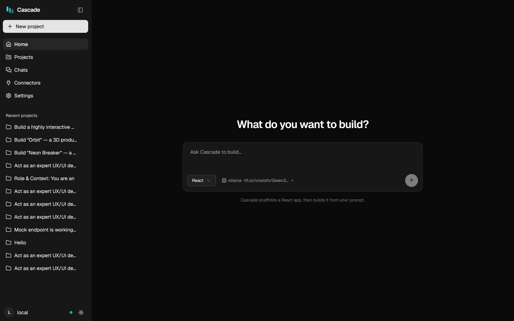
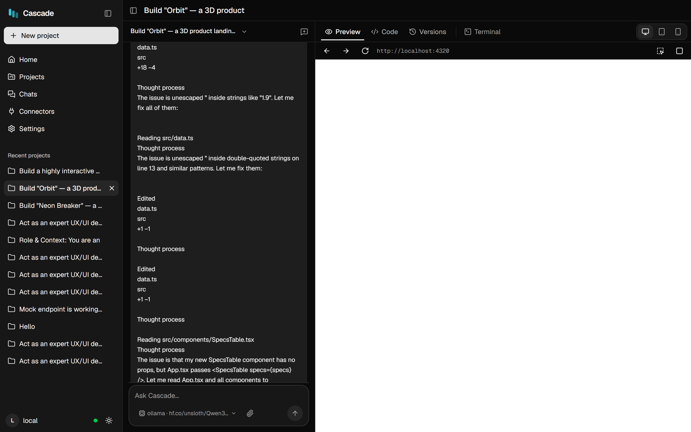
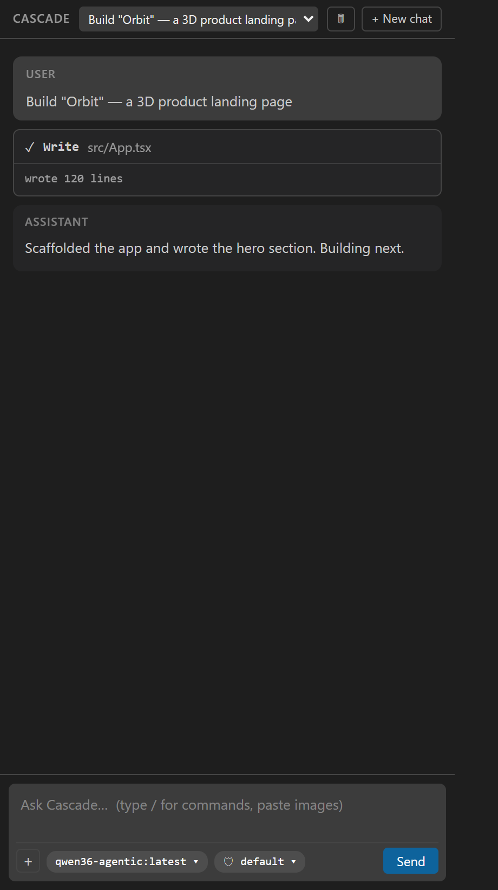

# Cascade — User Guide

**Cascade is an Ollama-native AI coding agent.** One headless engine drives two frontends: a **web app**
that builds whole apps from a prompt (with live preview, code editor and terminal), and a **VS Code
extension** that works like an in-IDE pair programmer on your own repository.

It runs your models — local ones through Ollama, or hosted ones through OpenAI, NVIDIA, Groq, OpenRouter,
or any OpenAI-compatible endpoint you point it at (including a rented GPU box).

  

---

## Contents

| Guide | What it covers |
|---|---|
| **[Getting started](getting-started.md)** | Install, start the server + web app, run the VS Code extension |
| **[Connecting providers](providers.md)** | Ollama, OpenAI, NVIDIA, Groq, OpenRouter, custom endpoints, API keys |
| **[Models & parameters](models.md)** | Curating your model list, context window, output cap, sampling, the utility model |
| **[The VS Code extension](extension.md)** | Chat, model picker, Language Models panel, skills, permissions |
| **[Connectors (MCP)](mcp.md)** | Adding MCP servers to give the agent extra tools |

---

## The two frontends

**Web app — build an app from a prompt.** You describe what you want; Cascade scaffolds a project, writes
the code, runs the build, and shows you the result in a live preview. Code, Versions and Terminal tabs sit
next to the preview, and every turn is checkpointed so you can roll back.

  

**VS Code extension — work in your own repo.** The same engine, minimal chrome: a chat panel with streaming
output, tool cards with inline diffs, a task checklist, and permission prompts before it writes anything.

  

---

## Why it's built this way

Cascade is designed around one constraint that hosted agents don't share: **a local model has a small
context window and a slow prefill.** Nearly every design decision follows from that.

- **Context economy** — the system prompt and tool descriptions are sized to the model's window; large tool
  outputs are masked or summarized before they crowd out the task.
- **KV-cache discipline** — reminders and recalled memories are appended at the *tail* of the conversation,
  never injected into the cached prefix, so a long session doesn't re-prefill from scratch every turn.
- **Recovery from weak-model failure** — the loop detects and interrupts the specific ways smaller models
  get stuck: editing one file over and over, repeating an identical call, drifting from the task list,
  claiming "done" without verifying, or generating a token spiral.

Everything the agent does is written to a JSONL trace under `.cascade/`, so a run can be replayed and
measured after the fact — which is where most of the above came from.

---

## Working on Cascade itself

This guide is for *using* Cascade. To build or extend it:

- **[`phase-00.md`](phase-00.md) … [`phase-13.md`](phase-13.md)** — the per-phase build guides, in order.
- **[`../adr/`](../adr/)** — architecture decision records: what was chosen, why, and the measurement
  behind it.
- **[`../PLAN.md`](../PLAN.md)** — the curriculum, and **[`../PROGRESS.md`](../PROGRESS.md)** — the status
  dashboard.
