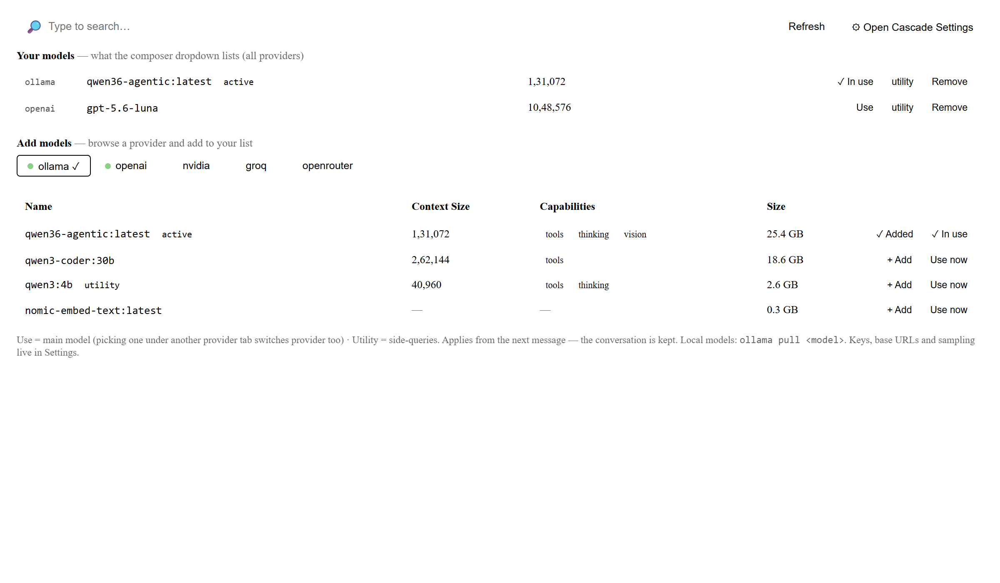

# The VS Code extension

Cascade in the IDE: the same engine as the web app, with minimal chrome. It reads and edits **your**
workspace, asks before it writes, and streams everything it does.

<p align="center">
  
</p>

---

## The chat panel

- **Streaming output** with a collapsible **💭 Thinking** block.
- **Tool cards** — each action shows as a card: a file edit renders an inline diff, a command shows its live
  output, `TodoWrite` renders the task checklist.
- **Permission prompts** — before a write, unless you've allowed it.
- **Context meter** — the hairline above the composer shows how full the window is; amber near the
  compaction threshold, red past it.
- **Paste an image** straight into the composer (vision models).

## The composer bar

<p align="center">
  
</p>

| Control | Purpose |
|---|---|
| **+** | Attach an image |
| **model ▾** | Switch model — your curated list, across providers; also opens the Language Models panel and Cascade settings |
| **🛡 mode ▾** | Permission mode: `default` · `acceptEdits` · `plan` · `bypass` |
| **Send / ■ Stop** | Send, or interrupt a running turn |

## Language Models panel

`/models`, the model chip, or **Cascade: Language Models** in the command palette opens a full editor tab:

<p align="center">
  
</p>

Provider tabs (green dot = configured), your curated models with **Use** / **utility** / **Remove**, each
provider's catalog with **+ Add**, pullable Ollama models with a **⬇ Pull** button that runs `ollama pull`
in a real terminal, and **🔑 Set API key** — stored in VS Code Secret Storage, encrypted and never synced.

---

## Slash commands

Type `/` in the composer:

| Command | Does |
|---|---|
| `/models` | Open the Language Models panel |
| `/mcp` | MCP server status — connect, disconnect, see each server's tools |
| `/memory` | View and search long-term memory; forget entries |
| `/<skill>` | Run a skill — e.g. `/new-app build a pomodoro timer` |

**Skills** are markdown playbooks the agent loads on demand. Cascade ships `new-app` (scaffold-first app
creation); add your own as `SKILL.md` files:

```
~/.cascade/skills/<name>/SKILL.md      # available in every workspace
<workspace>/.cascade/skills/<name>/    # project-specific; overrides a global one with the same name
```

They appear in the `/` menu automatically, and the model can invoke them itself.

---

## Chats

Conversations are saved per workspace under `.cascade/chats/`. Reopen the folder and your last chat comes
back — transcript and context both. The header dropdown switches between saved chats; **+ New chat** starts
a fresh one without destroying the old.

---

## Permission modes

| Mode | Behaviour | Use when |
|---|---|---|
| `default` | Asks before every write | Normal work |
| `acceptEdits` | Writes without asking; still asks to leave the workspace | Long autonomous runs |
| `plan` | Read-only — explores and proposes, cannot write | "What would you change?" |
| `bypass` | No prompts at all | Throwaway sandboxes only |

Paths **outside** your workspace always ask — even in `acceptEdits`, even for reads. To grant a folder
permanently, add it to `cascade.additionalDirectories`; other folders of a multi-root workspace are included
automatically.

---

## Diagnostics

- **Output → Cascade** logs every message the extension handles, and any error.
- **`.cascade/trace-*.jsonl`** in the workspace records each run in full — prompts, tool I/O, token counts
  and timings.
- A **banner at the top of the panel** means the extension host is running a different build than the UI:
  stop the debug session (Shift+F5) and press F5 again.
