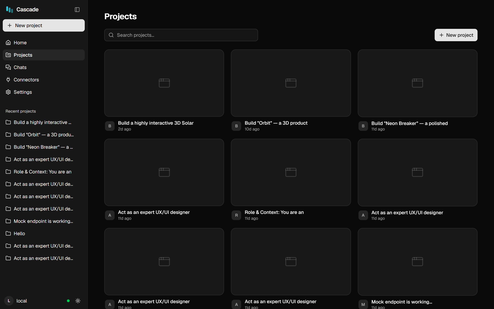
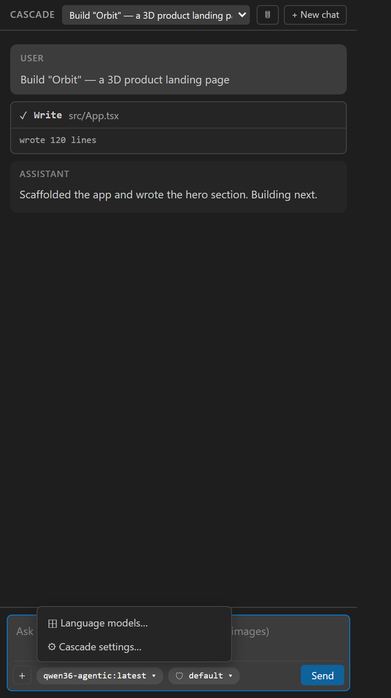

# Getting started

## Requirements

| | |
|---|---|
| **Node.js** | 20+ |
| **Ollama** | for local models — [ollama.com](https://ollama.com) |
| **Docker** | web app only: each project builds inside its own container |
| **Edge or Chrome** | for the agent's visual checks (no extra download — it drives a browser you already have) |

```bash
git clone https://github.com/abhee235/cascade.git
cd cascade
npm install
ollama pull qwen3:8b          # any tool-capable model
```

---

## The web app

Start the server and the web UI:

```bash
npm run dev -w @cascade/server     # WebSocket + preview proxy
npm run dev -w @cascade/web        # the UI, on http://localhost:5319
```

On Windows, `start-cascade.cmd` starts both — and Ollama with Cascade-friendly settings (a long keep-alive
so the model stays resident, flash attention, and a single parallel slot so the whole context window belongs
to your session).

Open **http://localhost:5319**, describe what you want to build, and press send.

<p align="center">
  
</p>

Each project gets its own container and lives under `packages/server/cascade-projects/<project>`. The
builder gives you a live **Preview**, a **Code** editor, **Versions** (a checkpoint per turn, with restore)
and a **Terminal** inside the container.

> **Security note:** the server binds to `127.0.0.1` and checks the browser's origin, and the UI fetches a
> per-run token before connecting. Don't expose port 4319 to a network you don't control.

---

## The VS Code extension

```bash
npm run build -w @cascade/extension
```

Then open the repo in VS Code and press **F5** — this launches an Extension Development Host with Cascade
loaded. Open the Cascade view from the activity bar.

<p align="center">
  
</p>

Configure it in **Settings → Cascade** (or the ⚙ entry in the model menu). The settings that matter first:

| Setting | Why |
|---|---|
| `cascade.model` / `cascade.provider` | Which model runs. Easier from the model menu. |
| `cascade.permissionMode` | `default` asks before writes; `acceptEdits` is right for long autonomous runs |
| `cascade.contextWindow` | Pin it if the model's Modelfile doesn't declare `num_ctx` |
| `cascade.checkCommand` | e.g. `npm run build` — defines "done" and gives the verify gate teeth |

> **After changing the extension's code**, stop the debug session fully (Shift+F5) and press F5 again.
> Reloading the window refreshes only the UI, not the extension host — if they disagree, Cascade shows a
> banner telling you so.

---

## First run checklist

1. **A tool-capable model** — look for the `TOOLS` badge in the model manager.
2. **Enough context** — 32k works; 64k+ is noticeably better for whole-app builds.
3. **A clean folder** (extension) — point it at the project you want changed, not at a parent directory.
4. **Watch the first turn** — if the model doesn't call a tool within a turn or two, it's probably not
   tool-capable.

## Where things are written

| Path | Contents |
|---|---|
| `<project>/.cascade/traces/*.jsonl` | Full forensic trace of every run — prompts, tool I/O, timings |
| `<project>/.cascade/chats/` | Saved conversations (extension) |
| `<project>/.cascade/todos.json` | The agent's task checklist |
| `CASCADE.md` / `.cascade/archival.json` | Long-term memory: always-on facts, and searchable ones |
