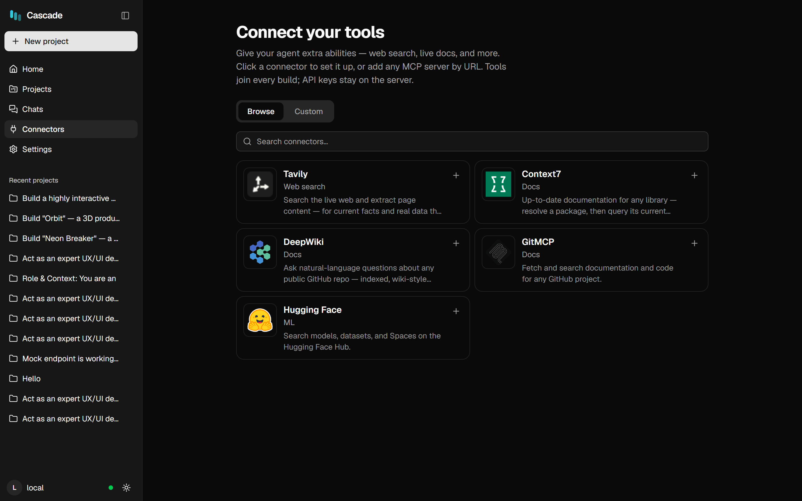

# Connectors (MCP)

MCP servers give the agent tools Cascade doesn't ship: web search, live library documentation, repository
Q&A, and anything else that speaks the Model Context Protocol. Their tools join the agent's toolset and are
callable like built-ins.

<p align="center">
  
</p>

---

## Web app

**Connectors** in the sidebar. **Browse** offers a curated set — Tavily (web search), Context7 (up-to-date
library docs), DeepWiki and GitMCP (repository Q&A), Hugging Face. Click **+**, paste the API key if the
service needs one, and it connects.

**Custom** adds any MCP server by URL with an optional bearer key.

Keys stay on the server: the browser is only ever told *whether* a key is set, never its value. Editing a
connector without re-entering the key keeps the stored one.

---

## VS Code extension

Two sources, merged (the project file wins on a name clash):

**`.mcp.json` at the workspace root** — the portable, shareable form:

```json
{
  "mcpServers": {
    "playwright": { "command": "npx", "args": ["-y", "@playwright/mcp@latest"] },
    "context7":   { "url": "https://mcp.context7.com/mcp" }
  }
}
```

**The `cascade.mcpServers` setting** — same shape, for servers you want in every workspace.

Type `/mcp` in the composer for live status: which servers are ready, connecting or failed, the error text
when one fails, and the tools each exposes. You can connect, disconnect and retry from there.

Servers connect **in the background** at startup — a slow or broken server never blocks your first message;
its tools simply appear when it's ready.

---

## Transports, and a security note

| Transport | Config | Notes |
|---|---|---|
| **HTTP** | `url` | No subprocess. Safe anywhere. |
| **stdio** | `command` + `args` | Spawns a process on your machine — full code execution |

Because stdio *is* arbitrary code execution, whether it's allowed is a decision of the frontend, not of the
config file:

- **The VS Code extension allows it.** It runs on your machine with a `.mcp.json` you wrote — the same trust
  model as any editor extension.
- **The web server refuses it** unless you set `CASCADE_ALLOW_STDIO_MCP=1`. Its project directories are
  writable by the model, so a model-written config must never be able to spawn host processes.

---

## Cost — read this before connecting everything

**Every connected tool is advertised on every request.** Its name, description and JSON schema are part of
the prompt, so a server with 20+ tools can cost **10–15k tokens per turn**.

Measured on a 32k-window local model: one MCP server consumed **44% of the entire window** in tool schemas,
leaving the conversation less room than the tool definitions. Compaction can't help — schemas aren't
history.

So: **connect what the task needs, disconnect what it doesn't.** In particular, the extension already ships
a built-in **Browser** tool (open, snapshot, screenshot, probe, click, audit) — if that covers your needs,
a browser-automation MCP server is redundant and expensive.
