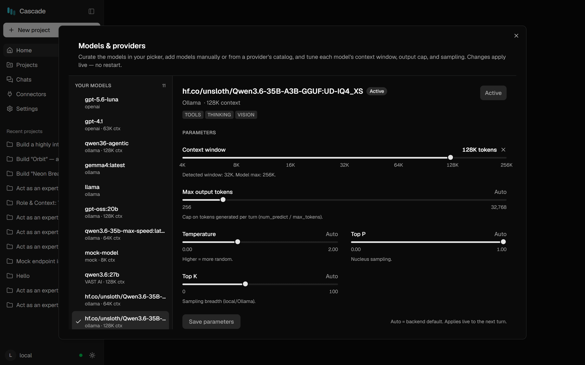

# Models & parameters

Cascade shows a **curated list** of models — the ones you chose — not a provider's entire catalog. This page
covers curating that list and tuning each model.

  

---

## Your models

**Your models** (left rail) is what the composer dropdown offers. It spans providers, so a local model and a
hosted one sit side by side.

- **Add** — *Add model* → pick a provider → click **+ Add** on a catalog row, or type a model id manually.
- **Activate** — click a model in the list. It becomes active from your next message.
- **Remove** — removes it from your picker only; nothing is deleted or uninstalled.

Each model shows its provider and context window; selecting one reveals its capabilities — `TOOLS`,
`THINKING`, `VISION` — probed live for Ollama models and taken from published specs for hosted ones.

---

## Parameters

Every model carries its own settings, applied when you activate it. **Auto** means "let the backend decide".

| Parameter | What it does | Guidance |
|---|---|---|
| **Context window** | How much conversation the model gets | Use the model's real maximum. Cascade shows the detected window and the architecture's ceiling beneath the slider. |
| **Max output tokens** | Cap per response (`num_predict` / `max_tokens`) | Auto derives ≈ window ÷ 8 (min 2048, max 16384). Raise it if long file writes get cut off. |
| **Temperature** | Randomness | Coding wants low — 0.2–0.7. Reasoning models often ignore it. |
| **Top P** | Nucleus sampling | Leave on Auto unless you're tuning deliberately. |
| **Top K** | Sampling breadth | Ollama/local only; hosted APIs don't expose it. |

> **Why cap the output at all?** With no cap, a local backend generates until the context fills. That's the
> ceiling that lets a stuck model produce thousands of junk tokens instead of stopping. A cap turns that
> into a clean cut the loop can recover from.

### The context window is the budget

Everything competes for it: the system prompt, **every tool description**, and the conversation. Two
practical consequences:

- **MCP servers are expensive.** A server with 20+ tools can cost 10–15k tokens of schemas on *every*
  request. On a 32k window that's half your budget before the model reads a single file. Connect only what
  you need for the task.
- **When context fills, Cascade compacts** — it masks old tool output and summarizes older turns. On local
  backends it compacts *rarely but deeply* (freeing 40–60% at once), because every compaction forces a full
  re-prefill; on hosted APIs it uses smaller, more frequent trims.

---

## The utility model (optional)

Compaction summaries and memory curation are side-queries. On one local GPU they compete with your main
model for the KV cache — so you can hand them to a small co-resident model instead:

- **VS Code:** set `cascade.utilityModel` (e.g. `qwen3:4b`)
- **Web:** mark a model as **utility** in the manager

Pull the small model first, and allow Ollama to keep more than one model loaded
(`OLLAMA_MAX_LOADED_MODELS=3`). Leave it unset to run side-queries on the main model, as before.

---

## Choosing a model

| Job | What matters |
|---|---|
| **Building an app end-to-end** | `TOOLS` support, a large window (64k+), and patience — this is the hardest task |
| **In-IDE edits and questions** | A mid-size local model is usually enough; window can be smaller |
| **Looking at screenshots** | `VISION` — required for the Browser tool's visual checks |
| **Utility / side-queries** | Smallest model that writes a coherent summary (3–4B) |
