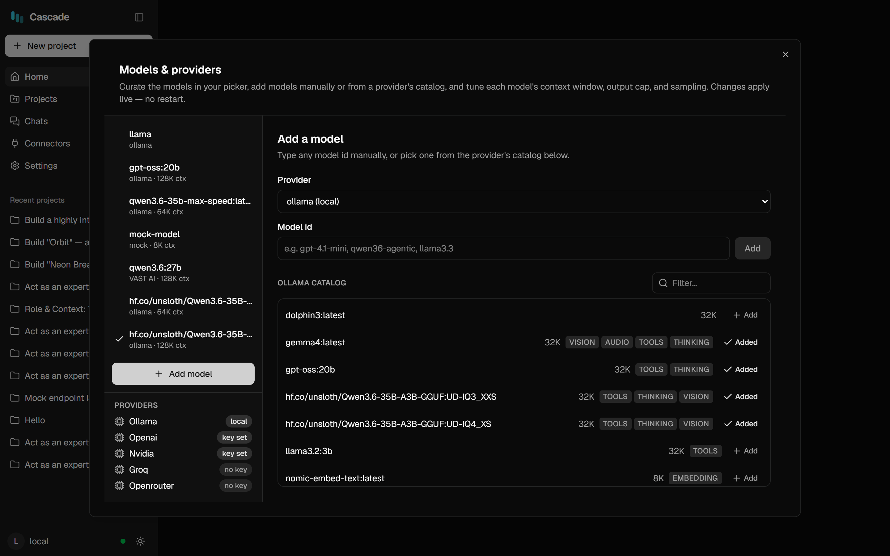
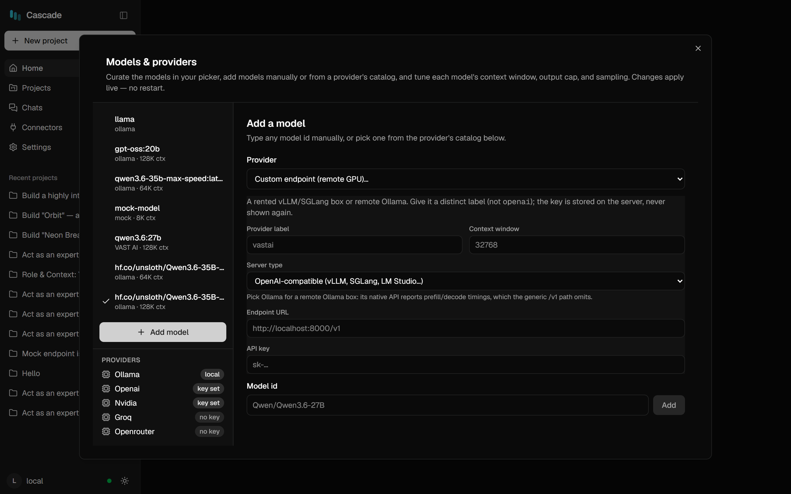
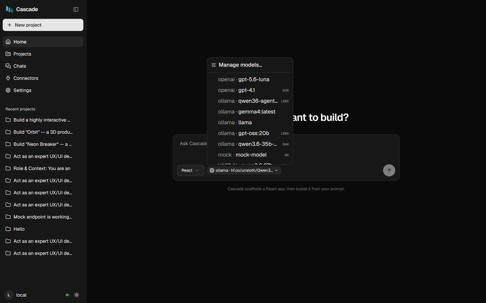

# Connecting providers

Cascade talks to any OpenAI-compatible backend plus Ollama's native API. This page covers the built-in
providers, API keys, and pointing Cascade at your own endpoint (a rented GPU, a remote Ollama, vLLM).

> **The short version:** open the model manager, pick a provider, add a model, click it. Changes apply from
> your next message — no restart, and your conversation is kept.

---

## The provider list

Open **Models & providers** — in the web app, click the model name in the composer → **Manage models…**;
in VS Code, run **Cascade: Language Models** or click the model chip.

<p align="center">
  
</p>

The **PROVIDERS** list (bottom-left) shows every provider and whether it is usable right now:

| Badge | Meaning |
|---|---|
| `local` | Ollama — no key needed, just needs to be running |
| `key set` | An API key was found for this provider |
| `no key` | Add a key before models will load |

| Provider | Default endpoint | Key |
|---|---|---|
| **Ollama** | `http://127.0.0.1:11434` | not needed |
| **OpenAI** | `https://api.openai.com` | `OPENAI_API_KEY` |
| **NVIDIA NIM** | `https://integrate.api.nvidia.com` | `NVIDIA_API_KEY` |
| **Groq** | `https://api.groq.com/openai` | `GROQ_API_KEY` |
| **OpenRouter** | `https://openrouter.ai/api` | `OPENROUTER_API_KEY` |
| **Custom** | you provide it | optional |

---

## Ollama (local)

1. Install Ollama and pull a model: `ollama pull qwen3:8b`
2. Make sure it's running: `ollama list`
3. In the manager, choose provider **ollama (local)** — its catalog lists everything you have installed,
   with each model's context window and capability badges (`TOOLS`, `THINKING`, `VISION`).
4. Click **+ Add** on a model to put it in your picker, then select it to make it active.

Cascade reads each model's real context window from Ollama (`/api/show`), so what the UI shows is what the
harness actually runs with. Two things worth setting in your `Modelfile`, because Cascade will honour them:

```dockerfile
PARAMETER num_ctx 131072      # the context window to allocate
PARAMETER num_predict 8192    # max tokens per response (otherwise generation is unbounded)
```

> **Tools are required.** An agent needs a model that supports tool calling — look for the `TOOLS` badge.
> A model without it can chat but cannot read or edit files.

---

## Hosted providers (OpenAI, NVIDIA, Groq, OpenRouter)

**1. Provide a key.** Three ways, most explicit first:

| Where | How | Notes |
|---|---|---|
| **VS Code** | Model manager → **🔑 Set API key** | Stored in VS Code **Secret Storage** (encrypted, never synced) — recommended |
| **Web app** | Model manager → provider → paste the key | Applies to the running server; not written to disk |
| **Either** | `.env` / environment variable | `OPENAI_API_KEY=…` — survives restarts, keep it out of git |

**2. Pick a model.** With a key present, the provider's catalog loads from its live `/v1/models`. Without a
key, Cascade still shows a **known catalog** for that provider (from its published model specs) so you can
see what's available before committing.

**3. Click it.** Selecting a model switches provider *and* model together and applies that model's saved
parameters.

---

## A custom endpoint (rented GPU, vLLM, remote Ollama)

Choose **Custom endpoint (remote GPU)…** in the provider list to configure a backend Cascade doesn't know
about — a vLLM/SGLang box, a remote Ollama, or any OpenAI-compatible gateway.

<p align="center">
  
</p>

You provide:

- **Endpoint URL** — e.g. `http://203.0.113.10:8000`
- **API key** — if the endpoint requires one
- **Context window** — for an OpenAI-compatible endpoint Cascade cannot detect this, so set it here;
  getting it wrong is the usual cause of silently truncated prompts
- **Server type** — **OpenAI-compatible** (`/v1/chat/completions`) or **native Ollama** (`/api/chat`)

> **Prefer "native Ollama" when the box runs Ollama.** The native API reports prefill/decode timings, which
> is what makes the performance numbers in your traces meaningful. The OpenAI-compatible path reports none.

---

## Switching models mid-conversation

Model switching is live. Pick a different model in the composer dropdown and your **next message** runs on
it — same conversation, same history, no restart. This works across providers too: you can start on a local
model and finish on a hosted one.

<p align="center">
  
</p>

---

## Troubleshooting

| Symptom | Cause | Fix |
|---|---|---|
| Provider shows `no key` | No key in settings/env | Add one (see above), then **Refresh** |
| Catalog is empty for Ollama | Ollama isn't running, or a different base URL | `ollama list`; check the base URL |
| `/v1/models` returns 401 | Invalid or expired key | Re-enter it; check the account |
| Model replies but never uses tools | Model lacks tool calling | Choose one with the `TOOLS` badge |
| Prompt seems truncated on a custom endpoint | Wrong context window | Set the real window in the endpoint config |
| Everything is slow after a long chat | Context is full; each turn re-prefills | Raise the window, or start a new chat |
